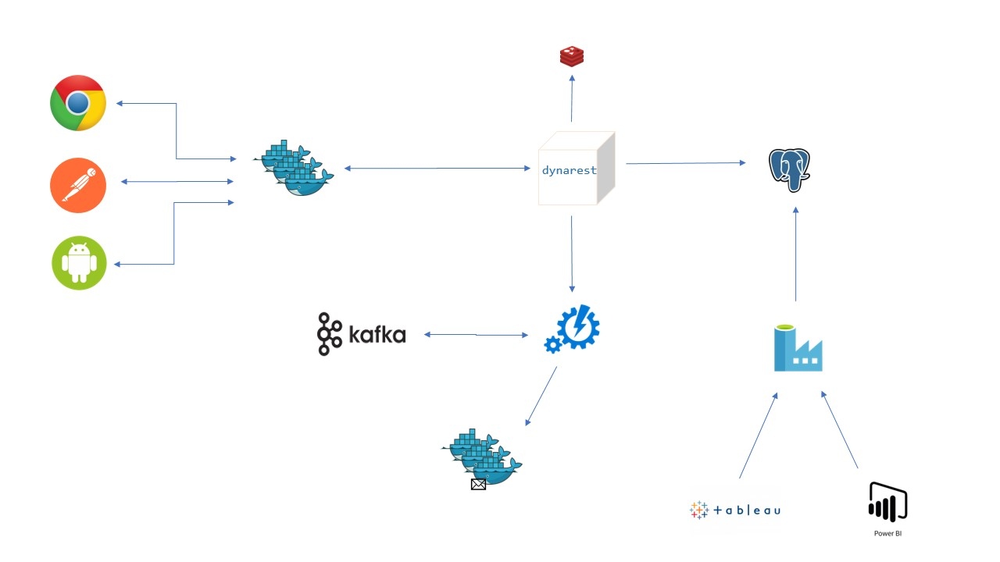

# nnotif


Prove of concept for a user notifications platform in NodeJS



### Techs

|                   | tech           |    version | note                  |
| ----------------- | -------------- | ---------: | --------------------- |
| platform          | node           |     19.5.0 |                       |
| lang              | typescript     |      4.9.4 |                       |
| linter            | eslint         |     8.32.0 |                       |
| formatter         | prettier       |      2.8.3 |                       |
| api               | expressjs      |     4.18.2 |                       |
| test              | jest           |     29.4.1 |                       |
| db                | postgres       |       14.5 | polyglot(SQL & NoSql) |
| container         | docker(linux)  |     4.13.0 | docker-desktop        |
| image             | node           | lts-alpine | lightweight & LTS     |
| orchestrator:dev  | docker-compose |     2.11.2 | docker-desktop        |
| orchestrator:prod | kubernetes     |       1.25 |                       |
| kube pkg manager  | helm           |     3.11.0 |                       |

CI-CD is achieved via a combination of docker-build & GitHub Actions. That is, you can have the workflow locally by running `docker build` because of the multi-stage Dockerfile which executes a bunch of CI tasks: `[restore-pks, build, lint, test, publish]`. This approach also ensures portability to any CI-CD runner.

## Helm

1- config hosts

If installing locally, add kube to hosts file. Example in linux:

`/etc/hosts`

add this line:

`127.0.0.1	nnotif.kubernetes.docker.internal`

2- install ingress-nginx

```
$> helm upgrade --install ingress-nginx ingress-nginx \
  --repo https://kubernetes.github.io/ingress-nginx \
  --namespace ingress-nginx --create-namespace
```

IMPORTANT: wait 3 minutes for ingress to get ready

3- Deploy

```
$> cd ./kube/prod
$> ./deploy
```

## Docker

### Specific service

Using `nnotif-dynarest` as example

#### Build

```
$> cd ./nnotif-dynarest
$> docker build -t build --progress=plain .
```

#### Start

```
$> cd ./nnotif-dynarest
$> docker compose up --build
```

### Whole Solution

```
$> docker compose up --build
```

Open this [link](http://localhost:3000/Resource/resource) in browser to se self describing api

## nnotif-dynarest [wip 🛠]

In a star style architecture, this service represents the center of the star. It will bring all the core and generic features for all the platform. It is a dynamic, data-driven, metadata-oriented, self-descriving REST server. That is, everithing is data, including the routes being registered to ExpressJS.


### Capabilities

| operation   | implemented | sample request          |
| ----------- | :---------: | ----------------------- |
| create      |      ✅      | `POST   /:type        ` |
| read        |      ✅      | `GET    /:type/:id    ` |
| upsert      |      ✅      | `PUT    /:type/:id    ` |
| remove      |      ❌      | `DELETE /:type/:id    ` |
| search      |      ❌      | `GET    /List?of=:type` |
| etag        |      ✅      | `GET    /:type/:id    ` |
| resource    |      ✅      | `POST   /Resource     ` |
| seq         |      ❌      | `POST   /Seq          ` |
| validations |      ❌      | `POST   /:type        ` |

### API

### Dev

```
$> git clone https://github.com/guillerglez88/nnotif.git

$> docker compose up --build

$> cd ./nnotif-dynarest
$> cp ./.env.tpl ./.env
$> npm run dev
```

### FS

```
.
├── docker-compose.debug.yml
├── docker-compose.yml
├── Dockerfile                 // multi-stage Dockerfile
├── .dockerignore
├── .env.tpl                   // must: $> cp ./.env.tpl ./.env
├── .eslintignore
├── .eslintrc.json             // linter config
├── jest.config.json           // test runner config
├── package.json
├── package-lock.json
├── .prettierrc.json           // formatter config
├── src
│   ├── app.ts
│   ├── bin
│   │   └── www.ts
│   ├── data                   // data access stufs
│   │   ├── ddl.ts             // SQL-DDL operations
│   │   ├── dml.ts             // SQL-DML operations
│   │   ├── dql.ts             // SQL-DQL operations
│   │   ├── storage.ts         // repository abstraction
│   │   └── transaction.ts     // db transactions operations
│   ├── libs                   // utility functions
│   │   ├── config.ts          // env strongly typed
│   │   ├── resource.ts        // resources normalization
│   │   ├── response.ts        // ExpressJS response utilities
│   │   └── routes.ts          // REST routes utilities
│   ├── modules                // feature modules
│   │   └── resource           // new resource type provisioning
│   │       ├── index.ts
│   │       └── trn.json.tpl
│   ├── nerves                 // REST operations
│   │   ├── create.ts          // POST /:type
│   │   ├── index.ts
│   │   ├── not-found.ts       // fallback at "/", not-implemented
│   │   ├── read.ts            //    GET /:type/:id     
│   │   ├── remove.ts          // DELETE /:type/:id     | not-implemented
│   │   ├── search.ts          //    GET /List?of=:type | not-implemented
│   │   ├── update.ts          //   POST /:type/:id     
│   │   └── upsert.ts          //    PUT /:type/:id     
│   ├── routes
│   │   └── index.ts           // db-routes -> expressjs
│   ├── seed                   // app bootstrap
│   │   ├── bootstrap.json     // fundation data raw
│   │   └── index.ts
│   └── types
│       ├── aliases.ts         // aliasses for ugly types
│       ├── data.ts            // data access types
│       ├── fundation.ts       // REST types
│       └── json.d.ts          // .json modules type def
├── test                       // tests, file structure matches src file structure
│   ├── data                   // data access tests
│   │   ├── ddl.test.ts        // SQL-DDL tests
│   │   ├── dml.test.ts        // SQL-DML tests
│   │   └── dql.test.ts        // SQL-DQL tests
│   ├── fixture.ts             // static test data
│   ├── libs                   // utility functions tests
│   │   ├── resource.test.ts   // resources normalization tests
│   │   ├── response.test.ts   // ExpressJS response utilities tests
│   │   └── routes.test.ts     // REST routes utilities tests
│   └── sanity.test.ts         // tests precondition checks
├── tsconfig.build.json        // build tscofig
├── tsconfig.json              // dev tsconfig
└── .vscode                    // vscode configs
    ├── launch.json
    └── tasks.json
```

## nnotif-public [wip 🛠]

Public back-for-front, RESTfull, subscriptions service. It works like a middleware between client apps and nnotif-dynarest. It narrows functionalities, scope and adding tailored validations.

### Capabilities

| operation | implemented | sample request         |
| --------- | :---------: | ---------------------- |
| subscribe |      ✅      | `POST   /subs        ` |
| details   |      ✅      | `GET    /subs/:id    ` |
| edit      |      ✅      | `PUT    /subs/:id    ` |
| list      |      ❌      | `GET /subs           ` |

### API

#### Subscribe:ok

**request -->**

```http
POST http://localhost:3001/subs
Accept: application/json
Content-Type: application/json

{
    "status": "active",
    "name": {
        "given": [
            "John"
        ],
        "family": ["Doe"]
    },
    "email": "nnotif-no-reply@mailinator.com",
    "gender": "male",
    "dob": "1988-04-18",
    "consent": true,
    "newsLetterId": "f03aad4e"
}
```

**response <--**

```http
HTTP/1.1 201 Created
X-Powered-By: Express
Location: /subs/0b615089-59c3-4f00-b370-e12158d375f3
ETag: "697"
Content-Type: application/json; charset=utf-8
Content-Length: 226
Date: Tue, 31 Jan 2023 17:30:25 GMT
Connection: close

{
  "id": "0b615089-59c3-4f00-b370-e12158d375f3",
  "status": "active",
  "email": "nnotif-no-reply@mailinator.com",
  "name": {
    "given": [
      "John"
    ],
    "family": [
      "Doe"
    ]
  },
  "gender": "male",
  "dob": "1988-04-18",
  "consent": true,
  "newsLetterId": "f03aad4e"
}
```

#### Subscribe:err

**request -->**

```http
POST http://localhost:3001/subs
Accept: application/json
Content-Type: application/json

{
    "status": "active",
    "name": {
        "given": [
            "John"
        ],
        "family": ["Doe"]
    },
    "gender": "male",
    "dob": "1988-04-18",
    "consent": true,
    "newsLetterId": "f03aad4e"
}
```

**response <--**

```http
HTTP/1.1 400 Bad Request
X-Powered-By: Express
Content-Type: application/json; charset=utf-8
Content-Length: 146
ETag: W/"92-dcwv9+IxW9fyy/8CH86xj9t5fu0"
Date: Tue, 31 Jan 2023 17:35:09 GMT
Connection: close

{
  "type": "Outcome",
  "issues": [
    {
      "level": "error",
      "code": "/Coding/nnotif-public-subs-issue?code=required",
      "desc": "Prop: `email: string` is required"
    }
  ]
}
```

#### Edit

Edit subscription with status: cancelled, means you are cancelling subscription.

**request -->**

```http
PUT http://localhost:3001/subs/338981fb-c1e6-4647-b8fc-3f1d950ea205
Accept: application/json
Content-Type: application/json

{
    "status": "cancelled",
    "name": {
        "given": [
            "John"
        ],
        "family": ["Doe"]
    },
    "email": "nnotif-no-reply@mailinator.com",
    "gender": "male",
    "dob": "1988-04-18",
    "consent": true,
    "newsLetterId": "f03aad4e"
}
```

**response <--**

```http
HTTP/1.1 200 OK
X-Powered-By: Express
ETag: "721"
Content-Type: application/json; charset=utf-8
Content-Length: 226
Date: Tue, 31 Jan 2023 17:38:07 GMT
Connection: close

{
  "id": "338981fb-c1e6-4647-b8fc-3f1d950ea205",
  "status": "cancelled",
  "email": "nnotif-no-reply@mailinator.com",
  "name": {
    "given": [
      "John"
    ],
    "family": [
      "Doe"
    ]
  },
  "gender": "male",
  "dob": "1988-04-18",
  "consent": true,
  "newsLetterId": "f03aad4e"
}
```

### Get Subs

**request -->**

```http
GET http://localhost:3001/subs/10c9aeb5-2d11-4038-aebb-79638445b0c1
```

**response <--**

```http
HTTP/1.1 200 OK
X-Powered-By: Express
ETag: "685"
Content-Type: application/json; charset=utf-8
Content-Length: 226
Date: Tue, 31 Jan 2023 17:40:52 GMT
Connection: close

{
  "id": "10c9aeb5-2d11-4038-aebb-79638445b0c1",
  "status": "cancelled",
  "email": "nnotif-no-reply@mailinator.com",
  "name": {
    "given": [
      "John"
    ],
    "family": [
      "Doe"
    ]
  },
  "gender": "male",
  "dob": "1988-04-18",
  "consent": true,
  "newsLetterId": "f03aad4e"
}
```

### Dev

```
$> git clone https://github.com/guillerglez88/nnotif.git

$> docker compose up --build

$> cd ./nnotif-public
$> cp ./.env.tpl ./.env
$> npm run dev
```

### FS

```
.
├── docker-compose.debug.yml
├── docker-compose.yml
├── Dockerfile                  // multi-stage dockerfile
├── .dockerignore
├── .env.tpl                    // must: $> cp ./.env.tpl ./.env
├── .eslintignore
├── .eslintrc.json              // linter config
├── jest.config.json            // test runner config
├── package.json
├── package-lock.json
├── .prettierrc.json            // formatter config
├── src
│   ├── app.ts
│   ├── bin
│   │   └── www.ts
│   ├── libs                    // utility functions
│   │   ├── config.ts           // env abstraction
│   │   ├── dob.ts              // date of birth related functions
│   │   ├── email.ts            // email related functions
│   │   ├── funcs.ts            // helper functions
│   │   ├── mappers.ts          // dto mapping functions
│   │   └── outcome.ts          // validation result functions
│   ├── routes
│   │   └── subs.ts             // subs routes
│   ├── services                
│   │   ├── dynarest.ts         // backend abstraction
│   │   └── validation.ts       // validations service
│   └── types
│       ├── aliases.ts          // weird types aliases
│       ├── data.ts             // data types
│       ├── json.d.ts           // json modules type def
│       └── validation.ts       // validations types
├── test                        // tests, same fs structure as src
│   ├── fixture.ts              // static test data
│   ├── libs
│   │   ├── mappers.test.ts     // dto mapper tests
│   │   └── outcome.test.ts     // validation result tests
│   ├── sanity.test.ts          // test precondition checks
│   └── services
│       └── validation.test.ts  // validation service tests
├── tsconfig.build.json
├── tsconfig.json
└── .vscode
    ├── launch.json
    └── tasks.json
```